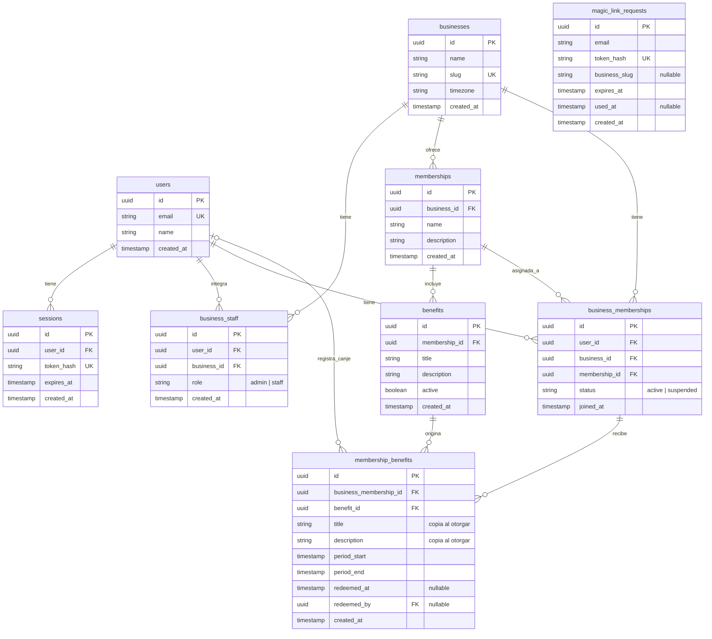

# Especificación del modelo de datos de loyalty

Estado: propuesta acordada a nivel conceptual; pendiente de implementación y de las decisiones indicadas al final.

## 1. Alcance

La plataforma permite que una persona cree y administre un negocio. Cada negocio vive inicialmente bajo `/b/:slug` y configura hasta tres tipos de membresía, con sus respectivos beneficios.

Los clientes tienen una única cuenta en la plataforma, pero su acceso y sus beneficios son independientes por negocio. Tener una cuenta o una sesión no otorga acceso automático a todos los negocios.

Los beneficios se renuevan mensualmente. El admin o staff del negocio puede marcar como utilizado un beneficio otorgado a un cliente.

La autenticación utiliza magic links enviados mediante Resend y sesiones almacenadas en la base de datos.

## 2. Vocabulario y responsabilidades

| Tabla | Responsabilidad |
|---|---|
| `users` | Identidad única de cada persona. No contiene un rol global. |
| `businesses` | Negocio, slug público y zona horaria. |
| `business_staff` | Relación administrativa o laboral de una persona con un negocio. |
| `memberships` | Tipos de membresía que ofrece un negocio: nombre y descripción. Máximo tres por negocio. |
| `benefits` | Definiciones de los beneficios incluidos en un tipo de membresía. |
| `business_memberships` | Relación de un cliente con un negocio y tipo de membresía asignado. |
| `membership_benefits` | Beneficios concretos otorgados al cliente para un período, incluyendo su estado de canje. |
| `sessions` | Sesiones autenticadas persistidas. |
| `magic_link_requests` | Solicitudes de acceso por email, pendientes, consumidas o expiradas. |

### Distinción central

`memberships` define una oferta del negocio, no una asignación a un usuario. Por eso no contiene `user_id`.

Ejemplo:

- `memberships`: Oro de Cafetería Pepe, con su descripción.
- `benefits`: un café gratis incluido en Oro.
- `business_memberships`: Juan es cliente de Cafetería Pepe y tiene Oro.
- `membership_benefits`: el café de febrero otorgado a Juan, disponible o canjeado.

Plata, oro y platino/diamante son nombres iniciales de ejemplo. El modelo permite nombres configurables; no son un enum global.

## 3. Diagrama de entidades



Los tipos del diagrama son conceptuales, no una migración SQL. Los instantes deben almacenarse con una representación inequívoca de zona horaria, por ejemplo `timestamptz` en PostgreSQL.

`magic_link_requests` es independiente: una solicitud puede existir antes de crear el usuario o una sesión. Su `business_slug` es contexto de navegación, no una clave de autorización.

## 4. Identidad, roles y acceso

### Usuarios

- Una persona mantiene una única cuenta entre negocios.
- El email es único bajo una política consistente de normalización.
- La sesión identifica al usuario, no su rol ni su membresía en un negocio.

### Admin y staff

`business_staff.role` admite `admin` o `staff`. El rol pertenece a la relación con un negocio, no a `users`.

Una persona puede administrar un negocio, trabajar en otro y ser cliente de un tercero. También puede ser staff y cliente del mismo negocio.

Al crear un negocio, su creador recibe una relación `business_staff` con rol `admin`. Ambas creaciones deben ser atómicas.

La configuración del negocio y sus membresías corresponde al admin. Admin y staff pueden registrar canjes. Los demás permisos detallados quedan pendientes de definición.

### Clientes

Un cliente se representa mediante `business_memberships`, con un único tipo de membresía asignado por negocio. El estado inicial propuesto admite `active` y `suspended`.

La autenticación no debe crear o reactivar una relación con un negocio sin aplicar la política de admisión que se defina.

### Aislamiento entre negocios

- El slug es único y normalizado; las relaciones persistentes usan IDs.
- En cada operación protegida, el servidor verifica el usuario, el negocio y la relación que autoriza el acceso.
- Conocer un ID o modificar el slug de la URL no concede acceso.
- El cliente consulta sus propios beneficios dentro del negocio autorizado.
- El staff solo opera sobre clientes y beneficios de negocios donde tiene permiso.
- `redeemed_by` se obtiene del usuario autenticado que registra el canje, no de un valor confiado al frontend.

## 5. Membresías y beneficios configurables

Cada negocio puede crear como máximo tres filas en `memberships`. Este límite no restringe la cantidad de clientes ni de filas en `business_memberships`.

Cada membresía expone nombre, descripción y una colección de beneficios en `benefits`.

Los beneficios tienen título y descripción libres. La elegibilidad, el período y el estado de canje son datos estructurados, no reglas inferidas del texto.

El modelo actual supone:

- Cada definición de beneficio pertenece a un solo tipo de membresía.
- Cada beneficio otorgado se puede utilizar una vez durante su período mensual.
- No hay herencia automática de beneficios entre tipos de membresía.
- `benefits.active` controla su disponibilidad para nuevos otorgamientos. Desactivarlo no elimina beneficios ya otorgados ni su historial.

## 6. Beneficios mensuales e historial

Cada fila de `membership_benefits` significa:

> A este cliente, en este negocio, le corresponde este beneficio durante este período.

El registro contiene una copia de `title` y `description` tomada de `benefits` al otorgarlo. Modificar la definición posteriormente no reescribe lo que el cliente recibió o utilizó.

### Estados derivados

No se necesita una columna adicional de estado:

| Condición | Estado |
|---|---|
| `redeemed_at` tiene valor | Utilizado |
| Sin canje y el instante actual es anterior a `period_start` | Próximo |
| Sin canje y el instante actual es igual o posterior a `period_end` | Vencido |
| Sin canje y dentro del período | Disponible |

El período usa el intervalo `[period_start, period_end)`: incluye su inicio y excluye su fin.

### Renovación

Cada mes se crean nuevos registros. No se borran ni se destachan los registros anteriores.

Ejemplo:

| Cliente | Beneficio | Período | Canje |
|---|---|---|---|
| Juan | Café gratis | Enero | Utilizado el 15/01 |
| Juan | Descuento del 20% | Enero | Sin utilizar |
| Juan | Café gratis | Febrero | Disponible durante febrero |

El otorgamiento debe ser idempotente: ejecutarlo otra vez para el mismo beneficio, cliente y período no crea duplicados.

La estrategia de generación queda pendiente: puede ser anticipada mediante un proceso programado o bajo demanda al acceder. En ambos casos, la disponibilidad se determina por las fechas del período.

### Canje

Al registrar un canje se guardan juntos `redeemed_at` y `redeemed_by`.

La operación debe verificar permisos, membresía habilitada, período vigente y ausencia de un canje previo. Debe ser atómica para que dos empleados no puedan consumir el mismo beneficio simultáneamente.

`membership_benefits` conserva beneficios disponibles e historial de períodos y canjes. No es una auditoría de todas las modificaciones. Deshacer un canje y registrar sus eventos queda fuera del alcance inicial.

## 7. Restricciones de integridad

### Unicidad

```text
users:
  UNIQUE(email)

businesses:
  UNIQUE(slug)

business_staff:
  UNIQUE(user_id, business_id)

business_memberships:
  UNIQUE(user_id, business_id)

membership_benefits:
  UNIQUE(business_membership_id, benefit_id, period_start)

sessions:
  UNIQUE(token_hash)

magic_link_requests:
  UNIQUE(token_hash)
```

### Consistencia

- Todas las referencias indicadas como FK deben tener integridad referencial.
- La membresía seleccionada en `business_memberships.membership_id` debe pertenecer a su `business_id`. Puede garantizarse con una FK compuesta y la clave única correspondiente.
- El beneficio otorgado debe pertenecer al mismo negocio y ser elegible para el tipo de membresía del cliente al momento del otorgamiento.
- Un cambio posterior de tipo no debe invalidar las referencias del historial a beneficios anteriores.
- `period_start` debe ser menor que `period_end`.
- `redeemed_at` y `redeemed_by` deben estar ambos vacíos o ambos completos.
- Los valores admitidos de roles y estados deben restringirse también en la base de datos.
- No se deben usar borrados en cascada que destruyan accidentalmente el historial de beneficios o canjes. La política completa de eliminación y anonimización queda pendiente.

### Límite de tres membresías

Una comprobación aislada de cantidad no es suficiente ante solicitudes simultáneas.

La creación debe hacerse en una transacción que bloquee la fila del negocio, cuente sus membresías y solo inserte si hay menos de tres. Todos los caminos de creación deben seguir esa misma operación.

## 8. Autenticación

### Flujo

```text
Persona entra a /b/:slug
  → Ingresa su email
  → Se crea una solicitud de magic link
  → Resend envía el enlace
  → La persona confirma el enlace
  → El servidor valida y consume el token una sola vez
  → Obtiene o crea el usuario
  → Crea una sesión en la base de datos
  → Establece la cookie de sesión
  → Regresa al negocio de origen
  → Verifica membresía o permisos de staff
```

### Requisitos

- Los tokens son aleatorios y se almacenan como hashes, no en texto plano.
- Los magic links tienen expiración corta y uso único; su consumo debe ser atómico.
- Las sesiones tienen expiración y pueden revocarse en la base de datos.
- La cookie de sesión utiliza `HttpOnly` y `Secure` en producción, con una política `SameSite` apropiada al flujo.
- El envío de enlaces requiere límites de frecuencia para prevenir abuso.
- El negocio de regreso se valida y resuelve internamente; no se acepta una redirección arbitraria.
- Resend entrega el email. La aplicación controla identidad, tokens, sesiones y autorización.

## 9. Consulta de beneficios del período actual

Primero, el servidor obtiene el usuario desde la sesión y busca su `business_memberships` en el negocio solicitado. Solo después de comprobar que puede acceder utiliza ese ID para consultar sus beneficios.

Ejemplo SQL para PostgreSQL:

```sql
SELECT
  id,
  title,
  description,
  redeemed_at
FROM membership_benefits
WHERE business_membership_id = $1
  AND period_start <= NOW()
  AND period_end > NOW()
ORDER BY title, id;
```

`$1` es el ID de la relación cliente-negocio previamente autorizada, no un ID aceptado del frontend sin validación.

La pantalla muestra:

- `redeemed_at` vacío: disponible.
- `redeemed_at` con fecha: utilizado.

Esta consulta supone que los beneficios del período ya fueron otorgados. Para consultar el historial se conservan los mismos filtros de autorización y se amplía el rango de períodos.

## 10. Decisiones pendientes

1. **Admisión de clientes:** quién crea la relación con el negocio y asigna su tipo de membresía.
2. **Renovación mensual:** mes calendario según la zona horaria del negocio o aniversario de inscripción.
3. **Cambio de membresía:** qué ocurre con beneficios otorgados y consumidos cuando el cliente cambia de tipo a mitad de período.
4. **Generación mensual:** proceso programado, bajo demanda o una combinación.
5. **Edición del catálogo durante un período:** si nuevos beneficios se otorgan inmediatamente o desde el siguiente período. Las copias ya otorgadas no se reescriben.
6. **Suspensión y reactivación:** efecto sobre otorgamientos, vencimientos y beneficios existentes.
7. **Permisos administrativos:** diferencias adicionales entre admin y staff, invitaciones y protección del último admin.
8. **Eliminación y retención:** archivo de membresías, tratamiento de usuarios eliminados y conservación o anonimización del historial.

## 11. Fuera del alcance inicial

- Puntos, sellos o reglas automáticas de acumulación.
- Beneficios con múltiples usos dentro de un período.
- Herencia automática entre tipos de membresía.
- Auditoría de cada edición o reversión de canjes.
- Identidades o credenciales diferentes para cada negocio.
