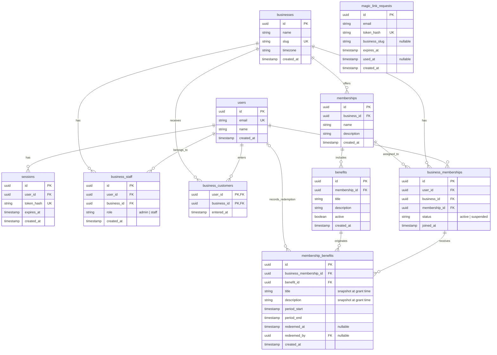

# Loyalty data model specification

Status: initial schema, magic links, per-business entry, customer benefit reads, and staff/owner route checks implemented; private mutations and the decisions listed at the end are still pending.

## 1. Scope

The platform allows a person to create and manage a business. Each business initially lives under `/b/:slug` and configures up to three membership types, with their respective benefits.

Customers have a single account on the platform, but their voluntary entry and benefits are independent for each business. Having an account or a session does not automatically grant access to every business's private data. A business's public presentation can be viewed without a session.

Benefits renew monthly. The business admin or staff can mark a benefit granted to a customer as used.

Authentication uses magic links sent through Resend and sessions stored in the database.

## 2. Vocabulary and responsibilities

| Table | Responsibility |
|---|---|
| `users` | Each person's unique identity. Does not contain a global role. |
| `businesses` | Business, public slug, and time zone. |
| `business_staff` | A person's administrative or employment relationship with a business. |
| `business_customers` | A person's voluntary entry into a business; grants no membership or permissions. |
| `memberships` | Membership types offered by a business: name and description. Maximum of three per business. |
| `benefits` | Definitions of the benefits included in a membership type. |
| `business_memberships` | A customer's relationship with a business and assigned membership type. |
| `membership_benefits` | Specific benefits granted to a customer for a period, including their redemption status. |
| `sessions` | Persisted authenticated sessions. |
| `magic_link_requests` | Email sign-in requests, pending, consumed, or expired. |

### Core distinction

`memberships` defines a business offering, not an assignment to a user. This is why it does not contain `user_id`.

Example:

- `memberships`: Gold at Pepe's Coffee Shop, with its description.
- `benefits`: a free coffee included in Gold.
- `business_memberships`: Juan is a customer of Pepe's Coffee Shop and has Gold.
- `membership_benefits`: the February coffee granted to Juan, available or redeemed.

Silver, gold, and platinum/diamond are initial example names. The model allows configurable names; they are not a global enum.

## 3. Entity diagram



The diagram's types are conceptual, not a SQL migration. Instants must be stored using an unambiguous time zone representation, such as `timestamptz` in PostgreSQL.

`magic_link_requests` is independent: a request can exist before a user or session is created. Its `business_slug` is navigation context, not an authorization key.

## 4. Identity, roles, and access

### Users

- A person maintains a single account across businesses.
- Email is unique under a consistent normalization policy.
- The session identifies the user, not their role or membership in a business.

### Admin and staff

`business_staff.role` accepts `admin` or `staff`. The role belongs to the relationship with a business, not to `users`.

A person can manage one business, work at another, and be a customer of a third. They can also be both staff and a customer of the same business. The staff/admin role works without requiring a row in `business_customers`; they can also enter as customers if they wish.

When a business is created, its creator receives a `business_staff` relationship with the `admin` role. Both creations must be atomic.

The admin is responsible for configuring the business and its memberships. Admin and staff can record redemptions. Other detailed permissions remain to be defined.

### Customers

`business_customers` records that an authenticated user clicked “Enter” at a business. The insertion is idempotent per user and business; it does not grant benefits, administrative permissions, or a membership. Someone can have this row without having obtained a membership. Businesses can be previewed without creating this row.

An obtained membership is represented by `business_memberships`, with a single membership type assigned per business. Its statuses are `active` and `suspended`. If a membership already exists, the person is also considered to have entered (including records predating `business_customers`).

Authentication must not create or reactivate a membership without applying the admission policy that is eventually defined.

### Isolation between businesses

- The slug is unique and normalized; persistent relationships use IDs.
- For every protected operation, the server checks the user, the business, and the relationship that authorizes access.
- Knowing an ID or modifying the URL slug does not grant access.
- Customers with an active membership query only their own currently granted benefits within the authorized business; suspended memberships are denied access to this view.
- Staff only operate on customers and benefits of businesses where they have permission.
- `redeemed_by` is obtained from the authenticated user recording the redemption, not from a value trusted to the frontend.

## 5. Configurable memberships and benefits

Each business can create at most three rows in `memberships`. This limit does not restrict the number of customers or rows in `business_memberships`.

Each membership exposes a name, description, and collection of benefits in `benefits`.

Benefits have free-form titles and descriptions. Eligibility, period, and redemption status are structured data, not rules inferred from the text.

The current model assumes:

- Each benefit definition belongs to a single membership type.
- Each granted benefit can be used once during its monthly period.
- There is no automatic benefit inheritance between membership types.
- `benefits.active` controls availability for new grants. Deactivating it does not delete previously granted benefits or their history.

## 6. Monthly benefits and history

Each row in `membership_benefits` means:

> This customer, at this business, is entitled to this benefit during this period.

The record contains a copy of `title` and `description` taken from `benefits` at grant time. Editing the definition later does not rewrite what the customer received or used.

### Derived statuses

No additional status column is needed:

| Condition | Status |
|---|---|
| `redeemed_at` has a value | Used |
| Not redeemed and the current instant is before `period_start` | Upcoming |
| Not redeemed and the current instant is at or after `period_end` | Expired |
| Not redeemed and within the period | Available |

The period uses the interval `[period_start, period_end)`: inclusive of its start and exclusive of its end.

### Renewal

New records are created each month. Previous records are neither deleted nor reset to unused.

Example:

| Customer | Benefit | Period | Redemption |
|---|---|---|---|
| Juan | Free coffee | January | Used on January 15 |
| Juan | 20% discount | January | Unused |
| Juan | Free coffee | February | Available during February |

Granting must be idempotent: running it again for the same benefit, customer, and period does not create duplicates.

The generation strategy remains undecided: it may run in advance through a scheduled process or on demand when accessed. In both cases, availability is determined by the period dates.

### Redemption

When recording a redemption, `redeemed_at` and `redeemed_by` are saved together.

The operation must check permissions, an enabled membership, a valid period, and the absence of a previous redemption. It must be atomic so that two employees cannot consume the same benefit simultaneously.

`membership_benefits` retains available benefits and the history of periods and redemptions. It is not an audit log of every change. Undoing a redemption and recording its events are outside the initial scope.

## 7. Integrity constraints

### Uniqueness

```text
users:
  UNIQUE(email)

businesses:
  UNIQUE(slug)

business_staff:
  UNIQUE(user_id, business_id)

business_customers:
  PRIMARY KEY(user_id, business_id)

business_memberships:
  UNIQUE(user_id, business_id)

membership_benefits:
  UNIQUE(business_membership_id, benefit_id, period_start)

sessions:
  UNIQUE(token_hash)

magic_link_requests:
  UNIQUE(token_hash)
```

### Consistency

- All references marked as FK must have referential integrity.
- The membership selected in `business_memberships.membership_id` must belong to its `business_id`. This can be enforced with a composite FK and the corresponding unique key.
- The granted benefit must belong to the same business and be eligible for the customer's membership type at grant time.
- A later type change must not invalidate historical references to previous benefits.
- `period_start` must be less than `period_end`.
- `redeemed_at` and `redeemed_by` must either both be empty or both be populated.
- Allowed role and status values must also be constrained in the database.
- Do not use cascading deletes that could accidentally destroy benefit or redemption history. The full deletion and anonymization policy remains undecided.

### Three-membership limit

An isolated count check is not sufficient under concurrent requests.

Creation must happen in a transaction that locks the business row, counts its memberships, and only inserts if there are fewer than three. All creation paths must follow the same operation.

## 8. Authentication

### Flow

```text
Person previews /b/:slug
  → Clicks “Enter”; if not signed in, enters their email
  → A magic link request is created
  → Resend sends the link
  → The person confirms the link with POST
  → The server validates and consumes the token exactly once
  → Retrieves or creates the user
  → Creates a session in the database
  → Sets the session cookie
  → Returns to the original business and clicks “Enter” if they have not already done so
  → A business_customers record is created; no membership is granted
  → Each private operation checks membership or staff permissions per business
```

### Requirements

- Tokens are random and stored as hashes, not plaintext.
- Magic links have a short expiration and are single-use; consuming them must be atomic.
- Sessions expire and can be revoked in the database.
- The session cookie uses `HttpOnly` and `Secure` in production, with a `SameSite` policy appropriate to the flow.
- Sending links requires rate limits to prevent abuse.
- The return business is validated and resolved internally; arbitrary redirects are not accepted.
- Resend delivers the email. The application controls identity, tokens, sessions, and authorization.

## 9. Querying benefits for the current period

First, the server obtains the user from the session and looks up their `business_memberships` record in the requested business. Only after verifying access does it use that ID to query their benefits.

SQL example for PostgreSQL:

```sql
SELECT
  id,
  title,
  description,
  redeemed_at
FROM membership_benefits
WHERE business_membership_id = $1
  AND period_start <= NOW()
  AND period_end > NOW()
ORDER BY title, id;
```

`$1` is the ID of the previously authorized customer-business relationship, not an ID accepted from the frontend without validation.

The screen displays:

- Empty `redeemed_at`: available.
- `redeemed_at` with a date: used.

This query assumes that the period's benefits have already been granted. History queries retain the same authorization filters and expand the period range.

## 10. Pending decisions

1. **Customer admission:** who creates the relationship with the business and assigns its membership type.
2. **Monthly renewal:** calendar month based on the business's time zone or enrollment anniversary.
3. **Membership changes:** what happens to granted and consumed benefits when the customer changes type mid-period.
4. **Monthly generation:** scheduled process, on demand, or a combination.
5. **Catalog edits during a period:** whether new benefits are granted immediately or starting with the next period. Previously granted snapshots are not rewritten.
6. **Suspension and reactivation:** effects on grants, expirations, and existing benefits.
7. **Administrative permissions:** additional differences between admin and staff, invitations, and protection of the last admin.
8. **Deletion and retention:** membership archival, handling of deleted users, and retention or anonymization of history.

## 11. Outside the initial scope

- Points, stamps, or automatic accrual rules.
- Benefits with multiple uses within a period.
- Automatic inheritance between membership types.
- Auditing every edit or redemption reversal.
- Separate identities or credentials for each business.
